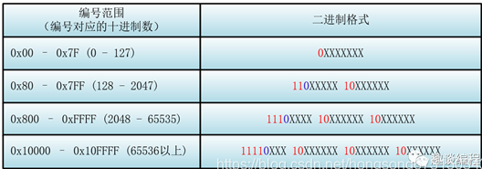
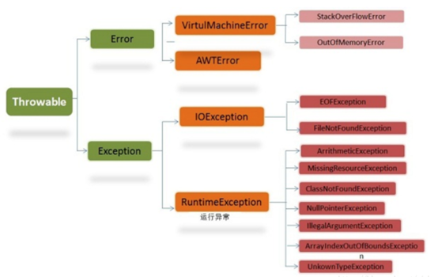
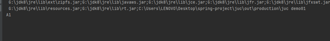
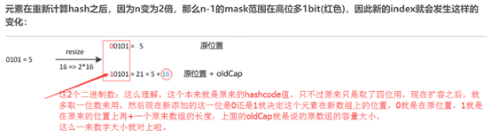

# 基础知识

## 1、ASCII、GBK、unicode、utf-8、utf-16关系

Unicode 为世界上所有字符都分配了一个唯一的数字编号，这个编号范围从 0x000000 到 0x10FFFF (十六进制)，有 110 多万，每个字符都有一个唯一的 Unicode 编号，这个编号一般写成 16 进制，Unicode 本身只规定了每个字符的数字编号是多少，并没有规定这个编号如何存储。

UTF-32：用四个字节完整存储Unicode码。

UTF-16：1、对于编号在 U+0000 到 U+FFFF 的字符（常用字符集），直接用两个字节表示。

2、编号在 U+10000 到 U+10FFFF 之间的字符，需要用四个字节表示。

UTF-8：1、对于单字节的符号，字节的第一位设为 0，后面的7位为这个符号的 Unicode 码，因此对于英文字母，UTF-8 编码和 ASCII 码是相同的。

2、对于n字节的符号 （n>1）,第一个字节的前 n 位都设为 1，第 n+1 位设为 0，后面字节的前两位一律设为 10，剩下的没有提及的二进制位，全部为这个符号的 Unicode 码 。



 

## 2、Stringbuilder和Stringbuffer区别

Stringbuilder是线程安全的，Stringbuffer是线程不安全的。

## 3、java中异常分类

 

1、Throwable有两个子类，Error和Exception。

2、Error：错误，对于所有的编译时期的错误以及系统错误都是通过Error抛出的。这些错误表示故障发生于虚拟机自身、或者发生在虚拟机试图执行应用时，如Java虚拟机运行错误（Virtual MachineError）、类定义错误（NoClassDefFoundError）等。这些错误是不可查的，因为它们在应用程序的控制和处理能力之外，而且绝大多数是程序运行时不允许出现的状况。对于设计合理的应用程序来说，即使确实发生了错误，本质上也不应该试图去处理它所引起的异常状况。在 Java中，错误通过Error的子类描述。

3、Exception：另外一个非常重要的异常子类。它规定的异常是程序本身可以处理的异常。异常和错误的区别是，异常是可以被处理的，而错误是没法处理的。 

4、Checked Exception：可检查的异常，除了RuntimeException及其子类以外，都是checked exception。==所有checked exception都是需要在代码中处理的，即必须trycatch或者throws声明抛出。==它们的发生是可以预测的，正常的一种情况，可以合理的处理。比如IOException、NoSuchMethodException。

5.Unchecked Exception

RuntimeException及其子类都是unchecked exception。比如NPE空指针异常，除数为0的算数异常ArithmeticException等等，这种异常是运行时发生，无法预先捕捉处理的。Error也是unchecked exception，也是无法预先处理的。

## 4、为什么java中泛型不能用基本数据类型？

因为java中泛型是用擦拭法，即虚拟机对泛型其实一无所知，所有的工作都是编译器做的。Java的泛型是由编译器在编译时实行的，编译器内部永远把所有类型T视为Object处理，但是，在需要转型的时候，编译器会根据T的类型自动为我们实行安全地强制转型。

局限一：<T>不能是基本类型，例如int，因为实际类型是Object，Object类型无法持有基本类型。

局限二：无法取得带泛型的Class，换句话说，所有泛型实例，无论T的类型是什么，getClass()返回同一个Class实例，因为编译后它们全部都是Pair<Object>。

局限三：无法判断带泛型的类型。

局限四：不能实例化T类型。

 

 

 

 

 

 

 

# 多线程

## 1、Violate关键字作用？如何保证可见性？

所有线程的共享变量都存储在主内存中，每一个线程都有一个独有的工作内存，每个线程不直接操作在主内存中的变量，而是将主内存上变量的副本放进自己的工作内存中，只操作工作内存中的数据。当修改完毕后，再把修改后的结果放回到主内存中。每个线程都只操作自己工作内存中的变量，无法直接访问对方工作内存中的变量，线程间变量值的传递需要通过主内存来完成。

上述的Java内存模型在单线程的环境下不会出现问题，但在多线程的环境下可能会出现脏数据，此时如果对变量i加上volatile关键字修饰的话，它可以保证当A线程对变量i值做了变动之后，会立即刷回到主内存中，而其它线程读取到该变量的值也作废，强迫重新从主内存中读取该变量的值，这样在任何时刻，AB线程总是会看到变量i的同一个值。

 ```java
public class demo01 {

  public static void main(String[] args) {

​    Data data1=new Data();

​    Data data2=new Data();

​    new Thread(new Runnable(){

 

​      @Override

​      public void run() {

​        for (int i=0;i<10;i++){

​          try {

​            data1.increase();

​          } catch (InterruptedException e) {

​             e.printStackTrace();

​          }

​        }

​      }

​    }, "A").start();

 

​    new Thread(new Runnable(){

 

​      @Override

​      public void run() {

​        for (int i=0;i<10;i++){

​         // System.out.println(i);

​          try {

​            data2.decrease();

​          } catch (InterruptedException e) {

​            e.printStackTrace();

​          }

​        }

​       }

​    }, "C").start();

 

  }

}

 

class Data{

  public static volatile int cnt=0;

  public synchronized void increase() throws InterruptedException {

​    while (cnt!=0){

​    }

​    System.out.println(Thread.currentThread().getName()+cnt);

​    cnt++;

  }

  public synchronized void decrease() throws InterruptedException {

​    while (cnt==0){

 

​    }

​    System.out.println(Thread.currentThread().getName()+cnt);

​    cnt--;


  }

 

}
 ```





以上代码会发生死锁，正是因为cnt变量在两个线程各自的缓存中，没有及时刷新会主存，因此只需要将cnt变量声明为violate即可解决问题。

 

##  2、synchronized三大特性

synchronized保证原子性的原理，synchronized保证只有一个线程拿到锁，能够进入同步代码块；

synchronized保证可见性的原理，执行synchronized时，会对应lock原子操作会刷新工作内存中共享变量的值；

synchronized保证有序性的原理，我们加synchronized后，依然会发生重排序，只不过，我们有同步代码块，可以保证只有一个线程执行同步代码中的代码。保证有序性；


## 3、CAS理解

 CAS即compare and swap，比较并交换。CAS 操作包含三个操作数 —— 内存位置（V）、预期原值（A）和新值(B)。 

如果内存位置的值与预期原值相匹配，那么处理器会自动将该位置值更新为新值 。否则，处理器不做任何操作。

他是乐观锁的一种实现方式，CAS操作只是CPU一条指令，不会进行被中断，从而保证了CAS操作的原子性。

lock大量使用CAS+自旋。因此根据CAS特性，lock建议使用在低锁冲突的情况下。目前java1.6以后，官方对synchronized做了大量的锁优化（偏向锁、自旋、轻量级锁）。因此在非必要的情况下，建议使用synchronized做同步操作。

 

 

# 容器

## 1、hashmap扩容以后，元素下标怎么重新计算？



因此，我们在扩充HashMap的时候，不需要像JDK1.7的实现那样重新计算hash，只需要看看原来的hash值新增的那个bit是1还是0就好了，是0的话索引没变，是1的话索引变成“原索引+oldCap”。

 

## 2、一般的容器怎么预防并发错误？

```
final void checkForComodification() 

{

           // expectedModCount在第一次遍历时会保存当前

          if (expectedModCount != ArrayList.this.modCount)

             throw new ConcurrentModificationException();

 }
```

在add，remove等操作时，会对modCount++，以保证遍历时，list没有被修改。

## 3、Hashmap的tostring（）实现方式

```
abstract class A{
    //声明迭代器方法,具体实现交给不同的子类重写去具体实现。
    abstract public int getnum();
    //
    public void tostring(){
        int num=getnum();
        System.out.println(num);
    }
}

class B extends A{

    @Override
    public int getnum() {
        return 2;
    }

    public static void main(String[] args) {
        B b=new B();
        //子类调用父类的tostring方法，里面再调用子类的getnum方法
        b.tostring();
    }
}
```


