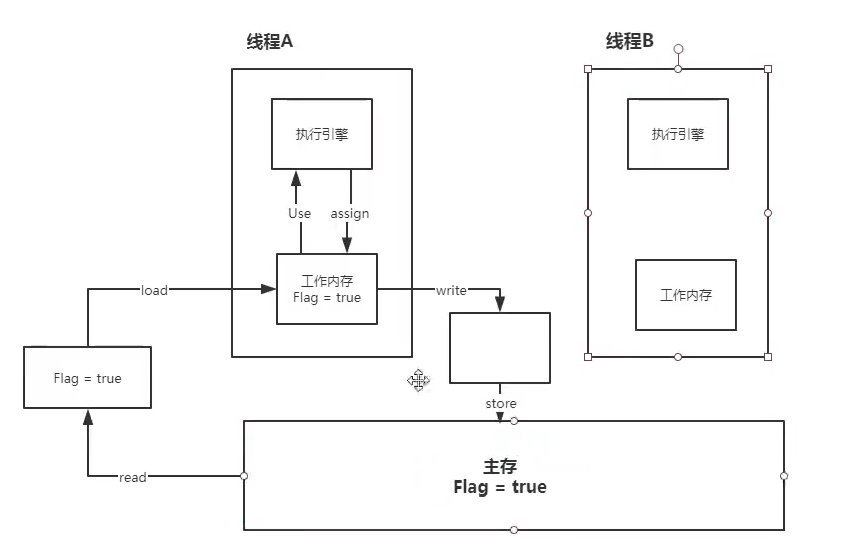
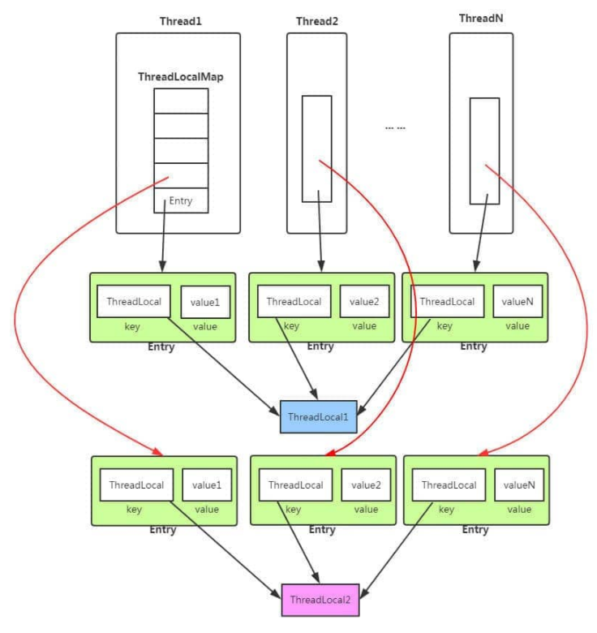
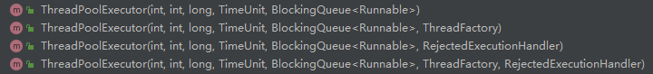
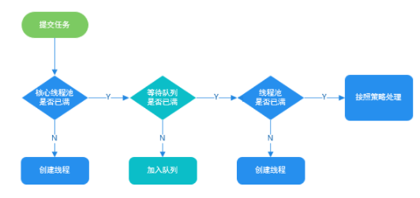

# 基础知识

## 1、ASCII、GBK、unicode、utf-8、utf-16关系

Unicode 为世界上所有字符都分配了一个唯一的数字编号，这个编号范围从 0x000000 到 0x10FFFF (十六进制)，有 110 多万，每个字符都有一个唯一的 Unicode 编号，这个编号一般写成 16 进制，Unicode 本身只规定了每个字符的数字编号是多少，并没有规定这个编号如何存储。

UTF-32：用四个字节完整存储Unicode码。

UTF-16：1、对于编号在 U+0000 到 U+FFFF 的字符（常用字符集），直接用两个字节表示。

2、编号在 U+10000 到 U+10FFFF 之间的字符，需要用四个字节表示。

UTF-8：1、对于单字节的符号，字节的第一位设为 0，后面的7位为这个符号的 Unicode 码，因此对于英文字母，UTF-8 编码和 ASCII 码是相同的。

2、对于n字节的符号 （n>1）,第一个字节的前 n 位都设为 1，第 n+1 位设为 0，后面字节的前两位一律设为 10，剩下的没有提及的二进制位，全部为这个符号的 Unicode 码 。


 

## 2、Stringbuilder和Stringbuffer区别

Stringbuilder是线程安全的，Stringbuffer是线程不安全的。

## 3、java中异常分类

 

1、Throwable有两个子类，Error和Exception。

2、Error：错误，对于所有的编译时期的错误以及系统错误都是通过Error抛出的。这些错误表示故障发生于虚拟机自身、或者发生在虚拟机试图执行应用时，如Java虚拟机运行错误（Virtual MachineError）、类定义错误（NoClassDefFoundError）等。这些错误是不可查的，因为它们在应用程序的控制和处理能力之外，而且绝大多数是程序运行时不允许出现的状况。对于设计合理的应用程序来说，即使确实发生了错误，本质上也不应该试图去处理它所引起的异常状况。在 Java中，错误通过Error的子类描述。

3、Exception：另外一个非常重要的异常子类。它规定的异常是程序本身可以处理的异常。异常和错误的区别是，异常是可以被处理的，而错误是没法处理的。 

4、Checked Exception：可检查的异常，除了RuntimeException及其子类以外，都是checked exception。==所有checked exception都是需要在代码中处理的，即必须trycatch或者throws声明抛出。==它们的发生是可以预测的，正常的一种情况，可以合理的处理。比如IOException、NoSuchMethodException。

5.Unchecked Exception

RuntimeException及其子类都是unchecked exception。比如NPE空指针异常，除数为0的算数异常ArithmeticException等等，这种异常是运行时发生，无法预先捕捉处理的。Error也是unchecked exception，也是无法预先处理的。

## 4、为什么java中泛型不能用基本数据类型？

因为java中泛型是用擦拭法，即虚拟机对泛型其实一无所知，所有的工作都是编译器做的。Java的泛型是由编译器在编译时实行的，编译器内部永远把所有类型T视为Object处理，但是，在需要转型的时候，编译器会根据T的类型自动为我们实行安全地强制转型。

局限一：<T>不能是基本类型，例如int，因为实际类型是Object，Object类型无法持有基本类型。

局限二：无法取得带泛型的Class，换句话说，所有泛型实例，无论T的类型是什么，getClass()返回同一个Class实例，因为编译后它们全部都是Pair<Object>。

局限三：无法判断带泛型的类型。

局限四：不能实例化T类型。

 

 

 

 

 

 

 

# 多线程

## 1、谈谈JMM

JMM：java内存模型

关于JMM一些线程同步的规定

1、线程解锁前，必须把共享变量==立刻==刷新回主存。

2、线程加锁前，必须读取主存中的最新值到工作内存。

3、加锁和解锁必须是同一把锁。



## 2、Violate关键字作用？如何保证可见性？

1、保证可见性

==2、不保证原子性==

3、禁止指令重排   前后开启内存屏障


所有线程的共享变量都存储在主内存中，每一个线程都有一个独有的工作内存，每个线程不直接操作在主内存中的变量，而是将主内存上变量的副本放进自己的工作内存中，只操作工作内存中的数据。当修改完毕后，再把修改后的结果放回到主内存中。每个线程都只操作自己工作内存中的变量，无法直接访问对方工作内存中的变量，线程间变量值的传递需要通过主内存来完成。

上述的Java内存模型在单线程的环境下不会出现问题，但在多线程的环境下可能会出现脏数据，此时如果对变量i加上volatile关键字修饰的话，它可以保证当A线程对变量i值做了变动之后，会立即刷回到主内存中，而其它线程读取到该变量的值也作废，强迫重新从主内存中读取该变量的值，这样在任何时刻，AB线程总是会看到变量i的同一个值。

 ```java
public class demo01 {

  public static void main(String[] args) {

​    Data data1=new Data();

​    Data data2=new Data();

​    new Thread(new Runnable(){

 

​      @Override

​      public void run() {

​        for (int i=0;i<10;i++){

​          try {

​            data1.increase();

​          } catch (InterruptedException e) {

​             e.printStackTrace();

​          }

​        }

​      }

​    }, "A").start();

 

​    new Thread(new Runnable(){

 

​      @Override

​      public void run() {

​        for (int i=0;i<10;i++){

​         // System.out.println(i);

​          try {

​            data2.decrease();

​          } catch (InterruptedException e) {

​            e.printStackTrace();

​          }

​        }

​       }

​    }, "C").start();

 

  }

}

 

class Data{

  public static volatile int cnt=0;

  public synchronized void increase() throws InterruptedException {

​    while (cnt!=0){

​    }

​    System.out.println(Thread.currentThread().getName()+cnt);

​    cnt++;

  }

  public synchronized void decrease() throws InterruptedException {

​    while (cnt==0){

 

​    }

​    System.out.println(Thread.currentThread().getName()+cnt);

​    cnt--;


  }

 

}
 ```


以上代码会发生死锁，正是因为cnt变量在两个线程各自的缓存中，没有及时刷新会主存，因此只需要将cnt变量声明为violate即可解决问题。

 

##  3、synchronized三大特性

synchronized保证原子性的原理，synchronized保证只有一个线程拿到锁，能够进入同步代码块；

synchronized保证可见性的原理，执行synchronized时，会对应lock原子操作会刷新工作内存中共享变量的值；

synchronized保证有序性的原理，我们加synchronized后，依然会发生重排序，只不过，我们有同步代码块，可以保证只有一个线程执行同步代码中的代码。保证有序性；


## 4、CAS理解

 CAS即compare and swap，比较并交换。CAS 操作包含三个操作数 —— 内存位置（V）、预期原值（A）和新值(B)。 

如果内存位置的值与预期原值相匹配，那么处理器会自动将该位置值更新为新值 。否则，处理器不做任何操作。

他是乐观锁的一种实现方式，CAS操作只是CPU一条指令，不会进行被中断，从而保证了CAS操作的原子性。

lock大量使用CAS+自旋。因此根据CAS特性，lock建议使用在低锁冲突的情况下。目前java1.6以后，官方对synchronized做了大量的锁优化（偏向锁、自旋、轻量级锁）。因此在非必要的情况下，建议使用synchronized做同步操作。

 

## 5、java开启多线程的几种方式？

1、继承Thread类，新建一个当前类对象，并且运行其start()方法

2、实现Runnable接口，然后新建当前类对象，接着新建Thread对象时把当前类对象传进去，最后运行Thread对象的start()方法

3、实现Callable接口，新建当前类对象，在新建FutureTask类对象时传入当前类对象，接着新建Thread类对象时传入FutureTask类对象，最后运行Thread对象的start()方法

4、线程池


```java
  //Thread 类run方法,要么继承Thread重写，要么给target。
  //Thred源码
  public void run() {
        if (target != null) {
            target.run();
        }
    }
    
  //FutureTask实现了runnable接口，有个callable接口的成员变量
  //FutureTask同时实现了里的run调用了call()
  //FutureTask源码
  public void run() {
            try {
                Callable<V> c = callable;
                if (c != null && state == NEW) {
                    V result;
                    boolean ran;
                    try {
                        result = c.call();
                        ran = true;
                    } catch (Throwable ex) {
                        result = null;
                        ran = false;
                        setException(ex);
                    }
                    if (ran)
                        set(result);
                }
            } finally {
               runner = null;
                int s = state;
                if (s >= INTERRUPTING)
                    handlePossibleCancellationInterrupt(s);
            }
        }
```


 

## 6、synchronized和lock区别

1.首先synchronized是java内置关键字，在jvm层面，Lock是个java类；

2.synchronized无法判断是否获取锁的状态，Lock可以判断是否获取到锁；

3.synchronized会自动释放锁(a 线程执行完同步代码会释放锁 ；b 线程执行过程中发生异常会释放锁)，Lock需在finally中手工释放锁（unlock()方法释放锁），否则容易造成线程死锁；

4.用synchronized关键字的两个线程1和线程2，如果当前线程1获得锁，线程2线程等待。如果线程1阻塞，线程2则会一直等待下去，而Lock锁就不一定会等待下去，如果尝试获取不到锁，线程可以不用一直等待就结束了；

5.synchronized的锁可重入、不可中断、非公平，而Lock锁可重入、可判断、可公平（两者皆可）

 6.Lock锁适合大量同步的代码的同步问题，synchronized锁适合代码少量的同步问题。


## 7、为什么lamda表达式中的临时变量需要为final类型

因为普通的临时变量为线程私有，存放在栈和堆中，切换线程就找不到了，而声明为final常量后，则为线程共享，不会出现问题。


## 8、Threadcal作用和实现原理

ThreadLocal类主要解决的就是让每个线程绑定自己的值，可以将ThreadLocal类形象的比喻成存放数据的盒子，盒子中可以存储每个线程的私有数据。

==实现原理==

Thread定义了ThreadLocalMap类型变量。  ThreadLocalMap以 ThreadLocal和object作为键值对的hashmap

```java
public class Thread implements Runnable {
    //......
    //与此线程有关的ThreadLocal值。由ThreadLocal类维护
    ThreadLocal.ThreadLocalMap threadLocals = null;

    //与此线程有关的InheritableThreadLocal值。由InheritableThreadLocal类维护
    ThreadLocal.ThreadLocalMap inheritableThreadLocals = null;
    //......
}
```

```java
public void set(T value) {
    //获取当前线程
    Thread t = Thread.currentThread();
    //获取当前线程的ThreadLocalMap
    ThreadLocalMap map = getMap(t);
    //如果map已经初始化
    if (map != null)
        //这里得this指代调用set函数的threadlocal变量。
        //比如num.set(1),this就指代num
        map.set(this, value);
    else
        createMap(t, value);
}
ThreadLocalMap getMap(Thread t) {
    return t.threadLocals;
}
```

所以threadlocal变量是存在在每个线程的内部的hashmap中，==并且以threadlocal变量为键==，实现不同local变量的存放

threadlocal实现原理图



我们可以看到ThreadLocal1和ThreadLocal2实际上是分布式存在于每个线程的threadlocalmap内部。


## 9、创建线程池的方式

**方式一：通过 Executor 框架的工具类 Executors 来实现**

**FixedThreadPool** ： 该方法返回一个固定线程数量的线程池。该线程池中的线程数量始终不变。当有一个新的任务提交时，线程池中若有空闲线程，则立即执行。若没有，则新的任务会被暂存在一个任务队列中，待有线程空闲时，便处理在任务队列中的任务。

**SingleThreadExecutor：** 方法返回一个只有一个线程的线程池。若多余一个任务被提交到该线程池，任务会被保存在一个任务队列中，待线程空闲，按先入先出的顺序执行队列中的任务。

**CachedThreadPool：** 该方法返回一个可根据实际情况调整线程数量的线程池。线程池的线程数量不确定，但若有空闲线程可以复用，则会优先使用可复用的线程。若所有线程均在工作，又有新的任务提交，则会创建新的线程处理任务。所有线程在当前任务执行完毕后，将返回线程池进行复用。

**ScheduledThreadPool：**方法返回一个能够定时执行任务的线程池。

==Executors 返回线程池对象的弊端如下：==

- **FixedThreadPool 和 SingleThreadExecutor** ： 允许请求的队列长度为 Integer.MAX_VALUE ，可能堆积大量的请求，从而导致 OOM。
- **CachedThreadPool 和 ScheduledThreadPool** ： 允许创建的线程数量为 Integer.MAX_VALUE ，可能会创建大量线程，从而导致 OOM。

**方式二：通过ThreadPoolExecutor 类构造 **



## 10、ThreadPoolExecutor 的七大参数

```java
/**
 * 用给定的初始参数创建一个新的ThreadPoolExecutor。
 */
public ThreadPoolExecutor(int corePoolSize,
                      int maximumPoolSize,
                      long keepAliveTime,
                      TimeUnit unit,
                      BlockingQueue<Runnable> workQueue,
                      ThreadFactory threadFactory,
                      RejectedExecutionHandler handler) {
    if (corePoolSize < 0 ||
        maximumPoolSize <= 0 ||
        maximumPoolSize < corePoolSize ||
        keepAliveTime < 0)
            throw new IllegalArgumentException();
    if (workQueue == null || threadFactory == null || handler == null)
        throw new NullPointerException();
    this.corePoolSize = corePoolSize;
    this.maximumPoolSize = maximumPoolSize;
    this.workQueue = workQueue;
    this.keepAliveTime = unit.toNanos(keepAliveTime);
    this.threadFactory = threadFactory;
    this.handler = handler;
}
```

+ **corePoolSize :** 核心线程数定义了最小可以同时运行的线程数量。
+ **maximumPoolSize :** 当队列中存放的任务达到队列容量的时候，当前可以同时运行的线程数量变为最大线程数。
+ **workQueue:** 当新任务来的时候会先判断当前运行的线程数量是否达到核心线程数，如果达到的话，新任务就会被存放在队列中。
+ **keepAliveTime**:当线程池中的线程数量大于 corePoolSize的时候，如果这时没有新的任务提交，核心线程外的线程不会立即销毁，而是会等待，直到等待的时间超过了 keepAliveTime才会被回收销毁；
+ **unit** : keepAliveTime 参数的时间单位。
+ **threadFactory**:executor 创建新线程的时候会用到。
+ **handler** :拒绝策略。

==线程池执行策略==



## 11、线程池的四大拒绝策略

**AbortPolicy：**抛出 RejectedExecutionException异常来拒绝新任务的处理。

**CallerRunsPolicy：**调用执行自己的线程运行任务，也就是直接在调用`execute`方法的线程中运行(`run`)被拒绝的任务，如果执行程序已关闭，则会丢弃该任务。因此这种策略会降低对于新任务提交速度，影响程序的整体性能。

**DiscardPolicy：** 不处理新任务，直接丢弃掉。

**DiscardOldestPolicy：** 此策略将丢弃最早的未处理的任务请求。


# 容器

## 1、hashmap扩容以后，元素下标怎么重新计算？


因此，我们在扩充HashMap的时候，不需要像JDK1.7的实现那样重新计算hash，只需要看看原来的hash值新增的那个bit是1还是0就好了，是0的话索引没变，是1的话索引变成“原索引+oldCap”。

 

## 2、一般的容器怎么预防并发错误？

```
final void checkForComodification() 

{

           // expectedModCount在第一次遍历时会保存当前

          if (expectedModCount != ArrayList.this.modCount)

             throw new ConcurrentModificationException();

 }
```

在add，remove等操作时，会对modCount++，以保证遍历时，list没有被修改。

## 3、Hashmap的tostring（）实现方式

```
abstract class A{
    //声明迭代器方法,具体实现交给不同的子类重写去具体实现。
    abstract public int getnum();
    //
    public void tostring(){
        int num=getnum();
        System.out.println(num);
    }
}

class B extends A{

    @Override
    public int getnum() {
        return 2;
    }

    public static void main(String[] args) {
        B b=new B();
        //子类调用父类的tostring方法，里面再调用子类的getnum方法
        b.tostring();
    }
}
```


