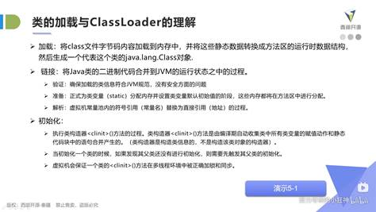

## 1、类加载过程

类加载过程

类初始化的时机

 

 

在准备阶段类的静态变量被设置为初始类型的零值。只有在初始化以后才会被设置为期望值，所以读取类的静态变量会导致类初始化并对类变量赋值。而final修饰的常量则是一步到位。详情见深入理解jvm370页。

##  2、JVM结构

## 3、**堆内存结构**

 

将堆分为新生代和老年代，新生代又分为eden区和Survior区

 

## 4、**方法区与永久代的区别？**

方法区是jvm的一种规定，并没有规定如何去实现，仅仅是当时的HotSpot虚拟机设计团队选择把收集器的分代设计扩展至方法区，或者说使用永久代来实现方法区而已，这样使得HotSpot的垃圾收集器能够像管理Java堆一样管理这部分内存，省去专门为方法区编写内存管理代码的工作。在JDK 6的时候HotSpot开发团队就有放弃永久代，逐步改为采用本地内存（Native Memory）来实现方法区的计划了 ，到了JDK 7的HotSpot，已经把原本放在永久代的字符串常量池、静态变量等移出，而到了JDK 8，终于完全废弃了永久代的概念，改用与JRockit、J9一样在本地内存中实现的元空间（Meta-space）来代替，把JDK 7中永久代还剩余的内容（主要是类型信息）全部移到元空间中。

目前，方法区的字符串常量、静态变量数据放在堆中，其他数据放在元空间

## 4、字符串常量、静态变量数据存放区域

java6中 所有常量池数据是存放在永久代中，但到java7后 Hostpot 把永久代中的字符串常量、静态变量数据迁移到了堆中，后面的java 8并没有对这部分内容进行迁移，在java8 中字符串常量、静态变量数据还是放到堆中，所以常量池只是在JVM规范定义上属于方法区，但Hotspot在实现的时候部分常量池的内容实际上是保存在堆中了。

 

