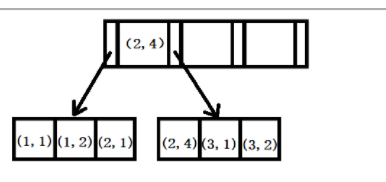
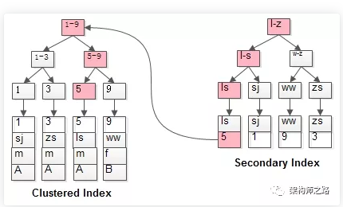
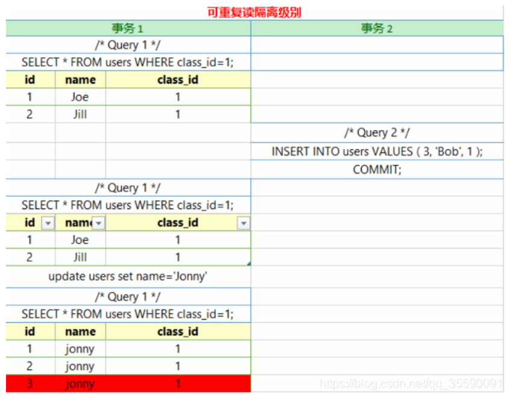

## 1、数据库ACID？

A原子性：事务是一个不可再分割的工作单位，事务中的操作要么都发生，要么都不发生。

C一致性：事务开始之前和事务结束以后，数据库的完整性约束没有被破坏。这是说数据库事务不能破坏关系数据的完整性以及业务逻辑上的一致性。

I隔离性：多个事务并发访问时，事务之间是隔离的，一个事务不应该影响其它事务运行效果。

D持久性：当一个事物提交之后，数据库状态永远的发生了改变。

## 2、MySQL **中** **InnoDB** **支持的四种事务隔离级别名称，以及逐级之间的区别？** 

SQL 标准定义的四个隔离级别为： 

1、read uncommited ：读到未提交数据 

2、read committed：脏读，不可重复读 

3、repeatable read：可重读 

4、serializable ：串行事物

Mysql默认为第三级隔离级别，sqlserver为第二个隔离级别。

前三种隔离级别为乐观锁，mysql中通过记录版本号来实现，MVCC技术，即多版本并发控制。

在MySQL中可重复读和读已提交都是通过MVCC进行实现的，却别在于可重读是事务启动的时候就生成read view整个事务结束都一直使用这个read view，而在读已提交中则是每执行一条语句就重新生成最新的read view。

第四种隔离级别为悲观锁，通过读写锁来实现

## 3、mvcc如何实现读已提交和重复读？

在 RC 隔离级别下，每个 SELECT 语句开始时，都会重新将当前系统中的所有的活跃事务拷贝到一个列表生成 ReadView。二者的区别就在于生成 ReadView 的时间点不同，可重复读是事务之后第一个 SELECT 语句开始，读已提交是事务中每条 SELECT 语句开始。

- trx_ids: 当前系统活跃(未提交)事务版本号集合。
  low_limit_id: 创建当前read view 时“当前系统最大事务版本号+1”。
  up_limit_id: 创建当前read view 时“系统正处于活跃事务最小版本号”
  creator_trx_id: 创建当前read view的事务版本号；

**Read view 匹配条件规则**如下：

1. （1）trx_id < up_limit_id || trx_id == creator_trx_id（显示）

   如果数据事务ID（trx_id）小于read view中的最小活跃事务ID（up_limit_id），则可以肯定该数据是在当前事务启之前就已经存在了的,所以可以显示。

   或者数据的事务ID（trx_id）等于creator_trx_id ，那么说明这个数据就是当前事务自己生成的，自己生成的数据自己当然能看见，所以这种情况下此数据也是可以显示的。

   （2）trx_id >= low_limit_id（不显示）

   如果数据事务ID（trx_id）大于read view 中的当前系统的最大事务ID，则说明该数据是在当前read view 创建之后才产生的，所以数据不显示。

   （3）如果trx_id < low_limit_id则进入下一个判断，判断trx_id是否在活跃事务（trx_ids）中

   不存在：则说明read view产生的时候事务已经commit了，这种情况数据则可以显示。
   已存在：则代表我Read View生成时刻，你这个事务还在活跃，还没有Commit，你修改的数据，我当前事务也是看不见的。


## 4、什么是脏读？不可重复读？幻读？

脏读：A事务执行过程中，B事务读取了A事务的修改。但是由于某些原因，A事务可能没有完成提交，发生RollBack了操作，则B事务所读取的数据就会是不正确的。

不可重复读：B事务读取了两次数据，在这两次的读取过程中A事务修改了数据，B事务的这两次读取出来的数据不一样。B事务这种读取的结果，即为不可重复读（Nonrepeatable Read）。修改了原数据

幻读：B事务读取了两次数据，在这两次的读取过程中A事务添加了数据，B事务的这两次读取出来的集合不一样。增加了数据

## 4、什么是乐观锁和悲观锁？

乐观锁的特点先进行业务操作，不到万不得已不去拿锁；即“乐观”的认为拿锁多半是会成功的，因此在进行完业务操作需要实际更新数据的最后一步再去拿一下锁就好；乐观锁在数据库上的实现完全是逻辑的，不需要数据库提供特殊的支持。一般的做法是在需要锁的数据上增加一个版本号，或者时间戳。

悲观锁的特点是先获取锁，再进行业务操作，即“悲观”的认为获取锁是非常有可能失败的，因此要先确保获取锁成功再进行业务操作；通常所说的“一锁二查三更新”即指的是使用悲观锁。

## 5、索引的底层实现原理和优化？

B+树，经过优化的 B+树。

主要是在所有的叶子结点中增加了指向下一个叶子节点的指针，因此 InnoDB 建议为大部分表使用默认自增的主键作为主索引。

## 6、索引为什么不用b树？

前提知识：我们知道从磁盘文件中读取数据是比较耗时的，数据库的select操作的时间，取决于执行磁盘IO的次数，因此尽量减少磁盘IO就可以显著的提升数据的查询速度。

我们应该知道B树和B+树最重要的一个区别就是B+树只有叶节点存放数据，其余节点用来索引，而B-树是每个索引节点都会有Data域。

这就决定了B+树更适合用来存储外部数据，也就是所谓的磁盘数据。

从Mysql（Inoodb）的角度来看，B+树是用来充当索引的，一般来说索引非常大，尤其是关系性数据库这种数据量大的索引能达到亿级别，所以为了减少内存的占用，索引也会被存储在磁盘上。

那么Mysql如何衡量查询效率呢？磁盘IO次数。B-树（B类树）的特点就是每层节点数目非常多，层数很少，目的就是为了就少磁盘IO次数，当查询数据的时候，最好的情况就是很快找到目标索引，然后读取数据，使用B+树就能很好的完成这个目的，但是B-树的每个节点都有data域（指针），这无疑增大了节点大小，说白了增加了磁盘IO次数（磁盘IO一次读出的数据量大小是固定的，单个数据变大，每次读出的就少，IO次数增多，一次IO多耗时啊！），而B+树除了叶子节点其它节点并不存储数据，节点小，磁盘IO次数就少。这是优点之一。

另一个优点是什么，B+树所有的Data域在叶子节点，一般来说都会进行一个优化，就是将所有的叶子节点用指针串起来。这样遍历叶子节点就能获得全部数据，这样就能进行区间访问啦。B+树只要遍历叶子节点就可以实现整棵树的遍历。而且在数据库中基于范围的查询是非常频繁的，而B树不支持这样的操作（或者说效率太低）

 

## 7、简单描述 **MySQL** 中，索引，主键，唯一索引，联合索引的区别，对数据库的性能有什么影响（从读写两方面）

索引是一种特殊的文件，它们包含着对数据表里所有记录的引用指针。

索引可以极大的提高数据的查询速度，但是会降低插入、删除、更新表的速度，因为在执行这些写操作时，还要操作索引文件。

唯一索引则是非null值唯一的索引，保证唯一性。

主键，是一种特殊的唯一索引，不能有null值，在一张表中只能定义一个主键索引，主键用于唯一标识一条记录，使用关键字 PRIMARY KEY 来创建。

索引可以覆盖多个数据列，如像 INDEX(columnA, columnB)索引，这就是联合索引。

## 8、什么情况下设置了索引但无法使用

1、以“%”开头的 LIKE 语句，模糊匹配

2、OR 语句前后没有同时使用索引

3、数据类型出现隐式转化（如 varchar 不加单引号的话可能会自动转换为 int 型）

4、对于多列索引，不是使用的第一部分，则不会使用索引

## 9、讲讲数据库最左适配原则？



如图所示，最左适配原则和索引的b+树底层有关，优先按照最左侧的关键字进行排序，除非第一个关键字相同，则按照后面的关键字排序，有点像sql语句里的order by

## 10、聚集索引与非聚集索引？

正文内容本身就是一种按照一定规则排列的目录称为聚集索引。

目录纯粹是目录，正文纯粹是正文的排序方式称为非聚集索引。

每个表只能有一个聚集索引，因为目录只能按照一种方法进行排序。如果不指定，一般情况下主键为默认聚集索引。

区别：

聚集索引一个表只能有一个，而非聚集索引一个表可以存在多个

聚集索引存储记录是物理上连续存在，而非聚集索引是逻辑上的连续，物理存储并不连续

聚集索引:物理存储按照索引排序；聚集索引是一种索引组织形式，索引的键值逻辑顺序决定了表数据行的物理存储顺序。

非聚集索引:物理存储不按照索引排序；非聚集索引则就是普通索引了，仅仅只是对数据列创建相应的索引，不影响整个表的物理存储顺序。

索引是通过二叉树的数据结构来描述的，我们可以这么理解聚簇索引：索引的叶节点就是数据节点。而非聚簇索引的叶节点仍然是索引节点，只不过有一个指针指向对应的数据块。


## 11、mvcc为什么要加next-lock锁

==快照读==

如果读取的行正在执行 `DELETE` 或 `UPDATE` 操作，这时读取操作不会去等待行上锁的释放。相反地，`InnoDB` 存储引擎会去读取行的一个快照数据。

==当前读==

- `select ... lock in share mode`
- `select ... for update`
- `insert`、`update`、`delete` 操作

以上，读取的是数据的最新版本，并且会加锁。

`MVCC`就是为了实现读-写冲突不加锁，而这个读指的就是==快照读==, 而非当前读，当前读实际上是一种加锁的操作，是悲观锁的实现。

`MVCC`就是维持一个数据的多个版本，使得读写操作没有冲突。

==MVCC + 悲观锁==
`MVCC`解决读写冲突，悲观锁解决写写冲突,所以必须加next-lock锁。


## 12、什么是回表？什么是索引覆盖？

正常情况下，当我们依据辅助索引进行查找时，需要经过两个步骤：

+ 依据字段值，在辅助索引上找到数据行所对应的主键id
+ 依据主键id，在b+树中查找数据

**回表：**从非主键索引树搜索回到主键索引树搜索的过程。

**索引覆盖：**即从非主键索引中就能查到的记录，而不需要查询主键索引中的记录，避免了回表的产生减少了树的搜索次数，显著提升性能。



## 13、索引何时会失效？

+ 不满足最左匹配原则。
+ 索引列上有计算。
+ 索引列用了函数。
+ 字符类型数据用整数类型赋值来查。
+ like左边包含%。
+ 使用or关键字，其中有一个关键字没有索引或者索引失效。
+ order by的一些使用情况。
+ https://mp.weixin.qq.com/s/ynGUGSbTdXbvEneFDVK88A


## 14、mysql的聚集索引如何确定？

+ 首先选择显式定义的主键索引做为聚集索引;
+ 如果没有，则选择第一个不允许NULL的唯一索引;
+ 还是没有的话，就采用InnoDB引擎内置的ROWID作为聚集索引;


## 15、mvcc解决幻读了么？

mvcc部分解决了幻读，但是在一些特殊的地方还是会出现幻读，比方说



1.a事务先select，b事务insert确实会加一个gap锁，但是如果b事务commit，这个gap锁就会释放（释放后a事务可以随意操作），

2.a事务再select出来的结果在MVCC下还和第一次select一样，

3.接着a事务不加条件地update，这个update会作用在所有行上（包括b事务新加的），

4.a事务再次select就会出现b事务中的新行，并且这个新行已经被update修改了.

==只有被update的数据才会被幻读，没有被updata的数据也不会被幻读。==

https://www.cnblogs.com/xuwc/p/13873293.html


## 16、数据库事务与spring事务的区别

spring的事务是对数据库的事务的封装,最后本质的实现还是在数据库,假如数据库不支持事务的话,spring的事务是没有作用的。

声明式事务管理建立在AOP之上的。其本质是对方法前后进行拦截，然后在目标方法开始之前创建或者加入一个事务，在执行完目标方法之后根据执行情况提交或者回滚事务。

@transaction注解实现

```java
protected Object invokeWithinTransaction(Method method, @Nullable Class<?> targetClass,
			final InvocationCallback invocation) throws Throwable {

		// ......
                // 这里TransactionAttributeSource对象保存了应用内所有方法上的@Transactional注解属性信息,利用Map来保存,其中
                // key由目标方法method对象+目标类targetClass对象组成,所以通过method+targetClass就能唯一找到目标方法上的@Transactional注解属性信息
		TransactionAttributeSource tas = getTransactionAttributeSource();
                // 这个TransactionAttribute对象就保存了目标方法@Transactional注解所有的属性配置,如timeout,propagation,readOnly等等,
                // 后续就利用这些属性完成对应的操作
		final TransactionAttribute txAttr = (tas != null ? tas.getTransactionAttribute(method, targetClass) : null);
		// ......
                TransactionInfo txInfo = createTransactionIfNecessary(ptm, txAttr, joinpointIdentification);

		Object retVal;
		try {
			// 这里最终会调用到目标方法
			retVal = invocation.proceedWithInvocation();
		} catch (Throwable ex) {
			// 目标方法抛出了异常,根据@Transactional注解属性配置决定是否需要回滚事务
			completeTransactionAfterThrowing(txInfo, ex);
			throw ex;
		}
                // ......
                // 目标方法正常执行完成,提交事务
		commitTransactionAfterReturning(txInfo);
		return retVal;
        }
```

## 17、乐观锁、悲观锁、MVCC的对比

**一、悲观锁**

1. 用来解决读-写冲突和写-写冲突的的加锁并发控制
2. 适用于写多读少，写冲突严重的情况，因为悲观锁是在读取数据的时候就加锁的，读多的场景会需要频繁的加锁和很多的的等待时间，而在写冲突严重的情况下使用悲观锁可以保证数据的一致性
3. 数据一致性要求高
4. 可以解决脏读，幻读，不可重复读，第一类更新丢失，第二类更新丢失的问题

**二、乐观锁**

1. 解决写-写冲突的无锁并发控制
2. 适用于读多写少，因为如果出现大量的写操作，写冲突的可能性就会增大，业务层需要不断重试，这会大大降低系统性能
3. 数据一致性要求不高，但要求非常高的响应速度
4. 无法解决脏读，幻读，不可重复读，但是可以解决更新丢失问题

**三、MVCC**

1. 解决读-写冲突的无锁并发控制。读取时不加锁，在写操作时会加写锁，保证并发写安全。
2. 与上面两者结合，提升它们的读性能。
3. 可以解决脏读，幻读，不可重复读等事务问题，更新丢失问题除外。

目前mysql采用MVCC + 悲观锁。MVCC解决读写冲突，悲观锁解决写写冲突。


## mvcc相关文章

mvcc介绍 https://blog.csdn.net/SeekN/article/details/118552170

数据库锁对比 https://zhuanlan.zhihu.com/p/266850866