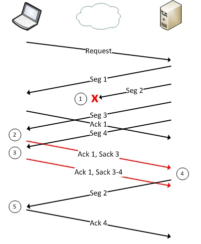
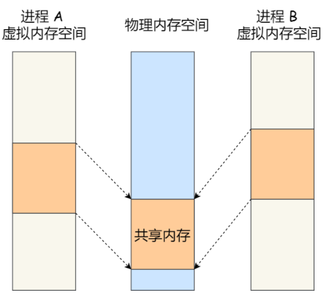

# 计算机网络

## 1、TCP与UDP区别

1、TCP面向连接。

​      UDP是无连接的。

2、TCP提供可靠的服务，也就是说，通过TCP连接传送的数据，无差错，不丢失，不重复，且按序到达。

​      UDP尽最大努力交付，即不保证可靠交付。

3、TCP面向字节流，实际上是TCP把数据看成一连串无结构的字节流。

​      UDP是面向报文的。

4、TCP首部开销20字节。

​      UDP的首部开销小，只有8个字节。

## 2、TCP的可靠性传输是如何保证的

1、确认和重传：接收方收到报文就会确认，发送方发送一段时间后没有收到确认就重传。

2、数据校验和

3、数据合理分片和排序：

　　UDP：IP数据报大于1500字节,大于MTU.这个时候发送方IP层就需要分片(fragmentation).把数据报分成若干片,使每一片都小于MTU.而接收方IP层则需要进行数据报的重组.这样就会多做许多事情,而更严重的是,由于UDP的特性,当某一片数据传送中丢失时,接收方便无法重组数据报.将导致丢弃整个UDP数据报.

　　tcp会按MTU合理分片，接收方会缓存未按序到达的数据，重新排序后再交给应用层。

4、流量控制：当接收方来不及处理发送方的数据，能提示发送方降低发送的速率，防止包丢失。

5、拥塞控制：当网络拥塞时，减少数据的发送。

## 3、拥塞控制的过程

对于TCP拥塞控制算法的三个过程来说，我们可以简单的概括为：
（1）当cwnd低于阈值，发送方处于慢启动阶段，窗口指数增长。
（2）当cwnd高于阈值，发送方处于拥塞避免阶段，窗口线性增长。
（3）当==发生快速重传==（收到三个重复的ACK出现）时，执行==快恢复==。阈值置为cwnd值的一半，并且cwnd为阈值+3或直接为1（根据不同版本决定）。
（4）当==超时==发生时，执行==慢开始==，阈值为cwnd值的一半并且cwnd置为1MSS。

推荐阅读 https://blog.csdn.net/qq_40459977/article/details/123079343

## 4、累计确认、选择重传、快速重传的区别

**累计确认**：只发送最小的已确认的报文序号。

问题：效率低，发送方每次都要将发送窗口内数据全部重新发送。

**选择重传**：在发送最小已确认报文基础上，携带已达到报文序号，减少发送的数据。

​        观察上面这幅图，其中左侧是接收方，右侧是发送方，与我们平常的方向恰好相反，大家注意一下。Seg2在图中处于丢失状态，那么接收方在收到后续的乱序数据时，显然会发送ACK1，表示1之前的数据已经收到了，我想要数据2。从图中可以看到，除了ACK1，还有一个信息是Sack3，这个的含义就是告诉发送端，虽然Seg2丢失了，但是我已经收到了Seg3，所以你之后超时重传的话，只需要把Seg2重传一下就好了。从而实现了TCP的**选择重传**。

**快速重传**：接收者如果接收到一个乱序的分组的话，就返回对前一个正确分组的确认应答，
当浏览器连续收到三个冗余ACK，就会马上快速重传丢失数据，不必等到超时时间再重传。

推荐阅读  https://segmentfault.com/a/1190000039659529?utm_source=tag-newest

# 操作系统

## 1、进程通信的7种方式

1、匿名管道：一种半双工的通信,数据只能单向流动,==而且只能在具有亲缘关系的进程间使用==进程的亲缘关系一般指的是父子关系.管道一般用于两个不同进程之间的通信。

==匿名管道保存在内存中，不存在于文件系统中，随着进程的结束而消失。==

2、有名管道：一种半双工的通信,数据只能单向流动，==允许无亲缘关系进程间的通信，存在于文件系统中==。

==问题：读写进程必须同时读写监听管道，否则进程会被阻塞。==因此效率较低。

3、消息队列：为了提高效率，消除进程阻塞的时间，消息队列诞生了。消息队列是保存在内核中的消息链表，消息这种模型，两个进程之间的通信就像平时发邮件一样，你来一封，我回一封，可以频繁沟通了。

问题：一是通信不及时，二是附件也有大小限制。消息队列通信过程中，==存在用户态与内核态之间的数据拷贝开销。==

4、共享内存：共享内存为了解决消息队列存在的==拷贝问题==而诞生。通过拿出一块虚拟地址空间来，==映射到相同的物理内存中==。这样这个进程写入的东西，另外一个进程马上就能看到了，都不需要拷贝来拷贝去，传来传去，大大提高了进程间通信的速度。

5、信号量：信号量其实是一个整型的计数器，主要用于实现进程间的互斥与同步，==而不是用于缓存进程间通信的数据。==比如。用了共享内存通信方式，带来新的问题，那就是如果多个进程同时修改同一个共享内存，很有可能就冲突了。

6、信号：主要用来操作系统对进程进行管理。

信号来源

用户按键：用户使用某种特殊字符递送给终端，产生一个信号（事件）递送给进程。
硬件故障：进程执行错误，比如访问一个无效内存地址，这时候先由硬件报告给内核，再由内核把事件递送给进程
kill函数或者命令：通过函数把需要的事件直接递送给进程

7、socket：前面提到的管道、消息队列、共享内存、信号量和信号都是在同一台主机上进行进程间通信，那要想==跨网络与不同主机上的进程之间通信==，就需要 Socket 通信了。

推荐好文：

https://blog.csdn.net/modi000/article/details/122084165